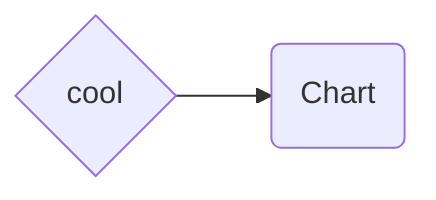
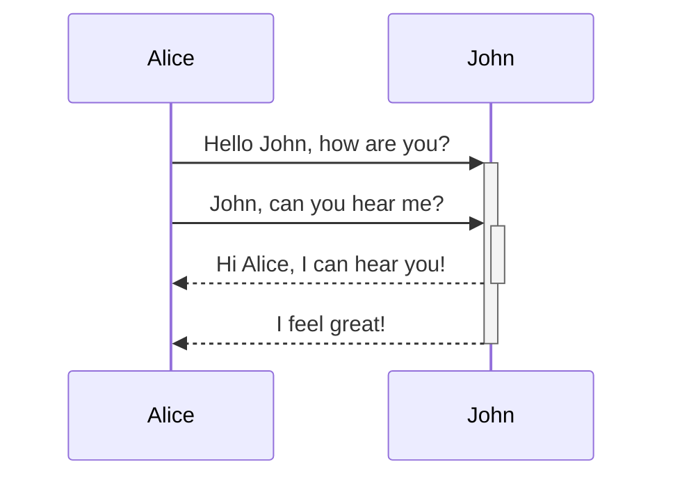
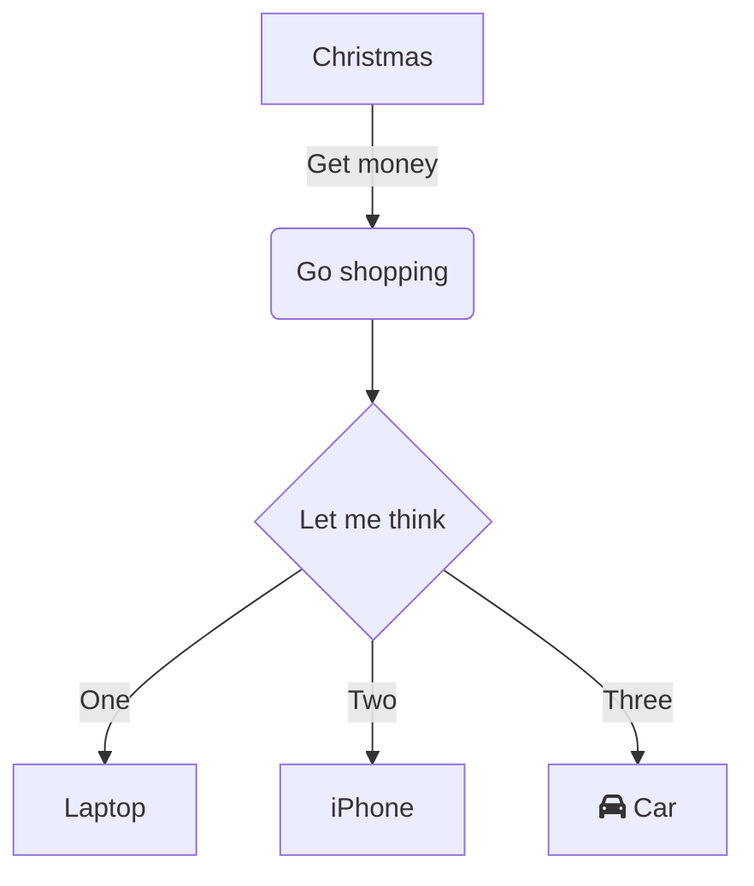
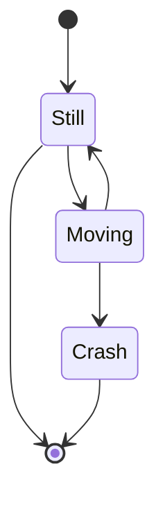
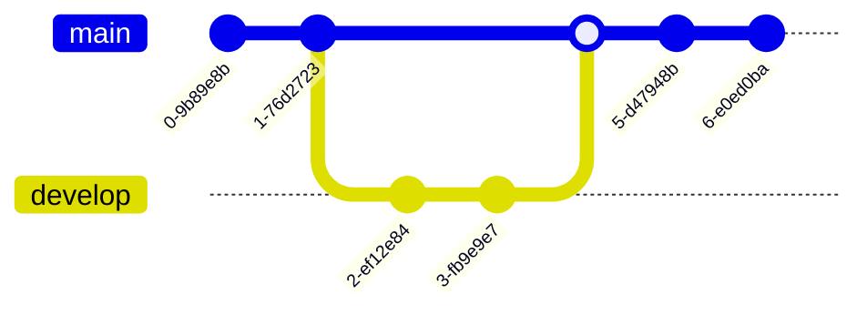

# Mermaid Demo

This can be removed once we have some mermaid examples in the codebase, but for
now, here's how we can use mermaid!

- mermaid is validated at build-time
  - `npm run build` will fail if we have _any_ invalid mermaid
  - in dev mode, invalid mermaid will be replaced with a friendly warning text
- note: mermaid rendering actually happens on the client; there is a mermaid
  init script which conditionally will dynamically import the mermaid.js
  library based on whether any mermaid elements are in the page after
  `DOMContentLoaded`.

## More Diagrams

